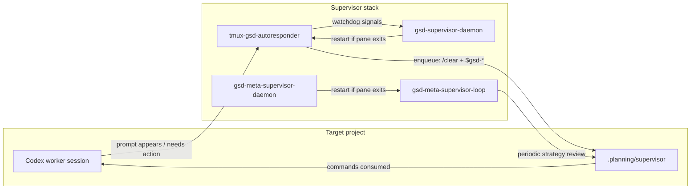
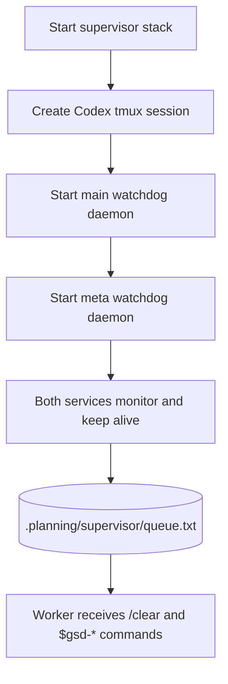

# codex-gsd-supervisor

A compact, standalone supervisor stack for automating Codex TUI workflows using local tmux + queue-based control.

[](LICENSE)

This repository provides two cooperating layers:

- **Main supervisor loop**: watches a worker Codex pane and dispatches `$gsd-*` commands from the command queue.
- **Meta supervisor loop**: runs periodic strategic analysis and injects high-value follow-up `$gsd-*` suggestions into the same queue.
- **Watchdogs**: keep both loops alive via `systemd --user` services or tmux sessions.

Everything is scoped to a target project root at runtime via `-r/--project-root`, so the same supervisor repo can manage multiple projects.

---

## Architecture overview





---

## Prerequisites

- `bash`
- `tmux`
- `codex` CLI
- `systemctl --user` (optional, for persistent services)
- `gh` (optional, only for publish step)

---

## Runtime artifacts (inside target project)

All state/logs/queue files are stored under the configured project root:

- `.planning/supervisor/autoresponder.log`
- `.planning/supervisor/daemon.log`
- `.planning/supervisor/meta-supervisor.log`
- `.planning/supervisor/meta-daemon.log`
- `.planning/supervisor/queue.txt`

Pause automation by placing one of these values in `.planning/supervisor/disabled`:

- `1`
- `true`
- `on`
- `pause`

Any other value or missing file keeps automation active.

---

## Quick start (standalone)

```bash
# inside project root, create/find this repo first
cd /home/forge/codex-gsd-supervisor

# 1) Start worker Codex tmux session
scripts/codex-tmux.sh -r /path/to/project -s codex-new -w codex

# 2) Prime worker behavior (recommended)
scripts/tmux-prime-codex-worker.sh -t codex-new:codex

# 3) Start main supervisor daemon in tmux
scripts/start-gsd-supervisor-daemon.sh -t codex-new:codex -r /path/to/project

# 4) Start meta supervisor loop in tmux
scripts/start-gsd-meta-supervisor.sh -t codex-new:codex -r /path/to/project
```

Attach to live sessions:

```bash
tmux attach -t codex-new
tmux attach -t gsd-supervisor-daemon
tmux attach -t gsd-meta-supervisor
```

---

## One-command persistence with user services

```bash
# Main loop + service
scripts/install-gsd-supervisor-service.sh -t codex-new:codex -r /path/to/project

# Meta loop + service
scripts/install-gsd-meta-supervisor-service.sh -t codex-new:codex -r /path/to/project
```

Service names default to:

- `gsd-supervisor-watchdog.service`
- `gsd-meta-supervisor.service`

Check status:

```bash
systemctl --user status gsd-supervisor-watchdog.service
systemctl --user status gsd-meta-supervisor.service
journalctl --user -u gsd-supervisor-watchdog.service -f
journalctl --user -u gsd-meta-supervisor.service -f
```

---

## Script map

- `scripts/codex-tmux.sh` — create/ensure the Codex TUI session
- `scripts/tmux-prime-codex-worker.sh` — seed initial supervisor behavior
- `scripts/tmux-gsd-autoresponder.sh` — watcher that evaluates Codex prompts and pushes commands
- `scripts/supervisor-queue.sh` — queue utility (`append`, `show`, `set`, `clear`)
- `scripts/start-gsd-supervisor-daemon.sh` — start main supervisor watcher + watchdog wrapper in tmux
- `scripts/start-gsd-meta-supervisor.sh` — start meta loop in tmux
- `scripts/gsd-supervisor-daemon.sh` — keep main watcher alive
- `scripts/gsd-meta-supervisor-daemon.sh` — keep meta watcher alive
- `scripts/install-gsd-supervisor-service.sh` — install main supervisor user service
- `scripts/install-gsd-meta-supervisor-service.sh` — install meta supervisor user service

---

## Manual queue operations

```bash
scripts/supervisor-queue.sh -r /path/to/project append '$gsd-plan-phase 5 --gaps'
scripts/supervisor-queue.sh -r /path/to/project show
```

---

## Publishing this repository

If you want to publish this project directly from this machine:

```bash
gh repo create codex-gsd-supervisor --public --source /home/forge/codex-gsd-supervisor --remote origin --push
```

That command creates the remote, sets `origin`, and pushes `main` in one step.

---

## Reference

- [operations.md](docs/operations.md)
- [MIT License](LICENSE)
