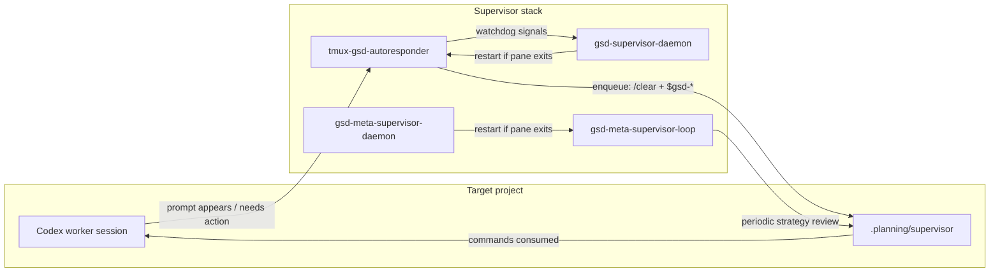
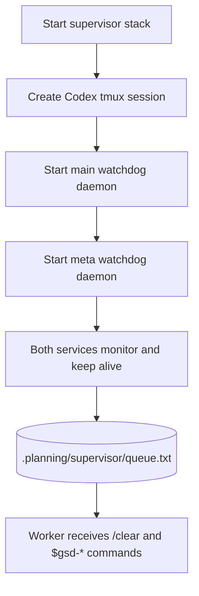

# codex-gsd-supervisor

A compact, standalone supervisor stack for automating Codex TUI workflows using local tmux + queue-based control.

[](LICENSE)

This repository provides two cooperating layers:

- **Main supervisor loop**: watches a worker Codex pane and dispatches `$gsd-*` commands from the command queue.
- **Meta supervisor loop**: runs periodic strategic analysis and injects high-value follow-up `$gsd-*` suggestions into the same queue.
- **Watchdogs**: keep both loops alive via `systemd --user` services or tmux sessions.

Everything is scoped to a target project root at runtime via `-r/--project-root`, so the same supervisor repo can manage multiple projects.

---

## Architecture overview





---

## Prerequisites

- `bash`
- `tmux`
- `codex` CLI
- `systemctl --user` (optional, for persistent services)
- `gh` (optional, only for publish step)

---

## Runtime artifacts (inside target project)

All state/logs/queue files are stored under the configured project root:

- `.planning/supervisor/autoresponder.log`
- `.planning/supervisor/daemon.log`
- `.planning/supervisor/meta-supervisor.log`
- `.planning/supervisor/meta-daemon.log`
- `.planning/supervisor/queue.txt`

Pause automation by placing one of these values in `.planning/supervisor/disabled`:

- `1`
- `true`
- `on`
- `pause`

Any other value or missing file keeps automation active.

---

## Quick start (standalone)

```bash
# inside project root, create/find this repo first
cd /home/forge/codex-gsd-supervisor

# 0) Start paired Codex sessions (Developer + Driver) for explicit decision/execution flow.
#    - Developer: planning/orchestration role
#    - Driver: execution role (runs $gsd commands and reports outcomes)
# Default is UI pair mode (real Codex panes).
scripts/codex-duet-link.sh -r /path/to/project start
# Alternative: agent loop mode (no Codex UI, direct codex exec automation)
scripts/codex-duet-link.sh -r /path/to/project --pair-name agent start --agent
scripts/codex-duet-link.sh -r /path/to/project --fresh --agent --pair-name agent start

# Run both modes in parallel with isolated state:
scripts/codex-duet-link.sh -r /path/to/project --pair-name agent --fresh \
  start --agent codex-myproj-developer codex-myproj-driver
scripts/codex-duet-link.sh -r /path/to/project --pair-name ui --fresh \
  start --ui codex-myproj-ui-developer codex-myproj-ui-driver

# 1) Start worker Codex tmux session (if needed)
scripts/codex-tmux.sh -r /path/to/project -s codex-new -w codex

# 2) Prime worker behavior (recommended)
scripts/tmux-prime-codex-worker.sh -t codex-new:codex

# 3) Start main supervisor daemon in tmux
scripts/start-gsd-supervisor-daemon.sh -t codex-new:codex -r /path/to/project

# 4) Start meta supervisor loop in tmux
scripts/start-gsd-meta-supervisor.sh -t codex-new:codex -r /path/to/project
```

Attach to live sessions:

```bash
tmux attach -t codex-new
tmux attach -t gsd-supervisor-daemon
tmux attach -t gsd-meta-supervisor
```

## Pair handoff and recovery notes (fresh session handoff)

These commands keep the Developer/Driver pair deterministic for any target project and avoid stale pair sessions.

```bash
cd /home/forge/codex-gsd-supervisor
PROJECT_ROOT=/path/to/project
DEVELOPER=codex-myproj-developer
DRIVER=codex-myproj-driver

# Optional hard reset for fresh start
tmux kill-session -t "$DEVELOPER" 2>/dev/null || true
tmux kill-session -t "$DRIVER" 2>/dev/null || true
rm -rf "$PROJECT_ROOT/.planning/supervisor/pair-link/${DEVELOPER}-${DRIVER}"

# Start clean automation pair:
./scripts/codex-duet-link.sh -r "$PROJECT_ROOT" --agent --fresh start "$DEVELOPER" "$DRIVER"

# Drive first action automatically if needed
./scripts/codex-duet-link.sh -r "$PROJECT_ROOT" send driver '$gsd-resume-work 6'
```

Watch it:

```bash
tmux attach -t "$DEVELOPER"
tmux attach -t "$DRIVER"

# Monitor forwarding evidence
tail -f "$PROJECT_ROOT/.planning/supervisor/pair-link/${DEVELOPER}-${DRIVER}/duet-bridge.log"

# Verify state and mode
./scripts/codex-duet-link.sh -r "$PROJECT_ROOT" status
./scripts/codex-duet-link.sh -r "$PROJECT_ROOT" status --all
```

Repo-agnostic target quick commands (this repository):

```bash
REPO_ROOT=/home/forge/codex-gsd-supervisor
PROJECT=/path/to/target-project
DEVELOPER=codex-$(basename "$PROJECT")-developer
DRIVER=codex-$(basename "$PROJECT")-driver

cd "$REPO_ROOT"
./scripts/codex-duet-link.sh -r "$PROJECT" --fresh --agent start "$DEVELOPER" "$DRIVER"
tmux attach -t "$DEVELOPER"
tmux attach -t "$DRIVER"
```

Known gotchas from current implementation:

- `--agent` sessions are automation loops (not Codex TUI).
- There may be stale state directories under `.planning/supervisor/pair-link`; `status --all` helps choose the active pair.
- If a session feels idle, check the bridge log and `tmux capture-pane` before assuming no work is happening.

---

## One-command persistence with user services

```bash
# Main loop + service
scripts/install-gsd-supervisor-service.sh -t codex-new:codex -r /path/to/project

# Meta loop + service
scripts/install-gsd-meta-supervisor-service.sh -t codex-new:codex -r /path/to/project
```

Service names default to:

- `gsd-supervisor-watchdog.service`
- `gsd-meta-supervisor.service`

Check status:

```bash
systemctl --user status gsd-supervisor-watchdog.service
systemctl --user status gsd-meta-supervisor.service
journalctl --user -u gsd-supervisor-watchdog.service -f
journalctl --user -u gsd-meta-supervisor.service -f
```

---

## Script map

- `scripts/codex-tmux.sh` — create/ensure the Codex TUI session
- `scripts/tmux-prime-codex-worker.sh` — seed initial supervisor behavior
- `scripts/tmux-gsd-autoresponder.sh` — watcher that evaluates Codex prompts and pushes commands
- `scripts/supervisor-queue.sh` — queue utility (`append`, `show`, `set`, `clear`)
- `scripts/start-gsd-supervisor-daemon.sh` — start main supervisor watcher + watchdog wrapper in tmux
- `scripts/start-gsd-meta-supervisor.sh` — start meta loop in tmux
- `scripts/gsd-supervisor-daemon.sh` — keep main watcher alive
- `scripts/gsd-meta-supervisor-daemon.sh` — keep meta watcher alive
- `scripts/codex-duet-link.sh` — pair a Driver/Developer Codex session for explicit two-agent coordination
- `scripts/codex-duet-bridge.sh` — message relay between the paired sessions
- `scripts/install-gsd-supervisor-service.sh` — install main supervisor user service
- `scripts/install-gsd-meta-supervisor-service.sh` — install meta supervisor user service

---

## Manual queue operations

```bash
scripts/supervisor-queue.sh -r /path/to/project append '$gsd-plan-phase 5 --gaps'
scripts/supervisor-queue.sh -r /path/to/project show
```

---

## Publishing this repository

If you want to publish this project directly from this machine:

```bash
gh repo create codex-gsd-supervisor --public --source /home/forge/codex-gsd-supervisor --remote origin --push
```

That command creates the remote, sets `origin`, and pushes `main` in one step.

---

## Reference

- [operations.md](docs/operations.md)
- [MIT License](LICENSE)
